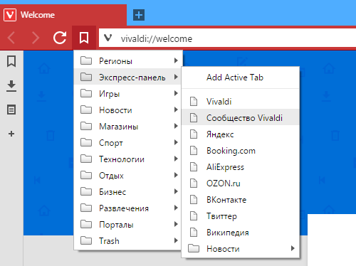
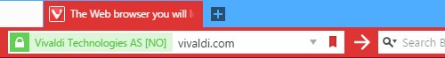
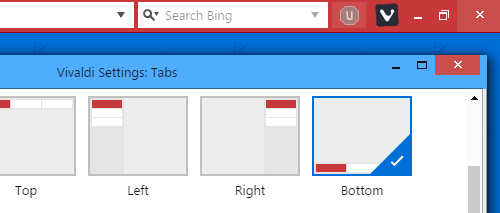
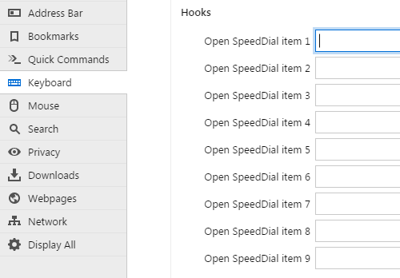

# VivaldiHooks

[SPDX-FileCopyrightText: © 2016-2020 Denis Porfiryev <denis.porfiryev@nokia.com>]::
[SPDX-FileCopyrightText: 🄯 2020 Peter J. Mello <admin@petermello.net>]::

[SPDX-License-Identifier: WTFPL]::

## About

VivaldiHooks is a set of scripts that modify the behavior of the
[Vivaldi web browser](https://vivaldi.com/) in an effort to make it even more
awesome than it already is.
The main one - `jdhooks.js` - controlls mods loading and provides mod developers a way to change behaviour of Vivaldi internal components.

### Wiki

Visit the [Wiki](https://github.com/justdanpo/VivaldiHooks/wiki) if you'd like to learn [what hooks are](https://github.com/justdanpo/VivaldiHooks/wiki/Hooks) or what is involved in [developing a hook](https://github.com/justdanpo/VivaldiHooks/wiki/Howto-dev).

### Vivaldi Forum

There's a thread on the Vivaldi Forum where most of the discussion among users
of these hooks takes place available
[here](https://forum.vivaldi.net/topic/11298/vivaldihooks-more-useful-mods). The
list below is updated daily with direct links to the three most recent posts in
it.

#### Most recent forum posts about VivaldiHooks

<!--START_SECTION:recentposts-->

<!--END_SECTION:recentposts-->

## Installation

### Automatic (Windows only)

Just run **installhooks.bat**. It will find installation path automatically if Vivaldi is set as your default browser.

If Vivaldi is installed in "Program Files" or any other write-restricted folder, you must run the script as Administrator.

You may specify a path in a command line:

    installhooks.bat C:\programz\Vivaldi-snapshots\1.5.609.8\Application
    installhooks.bat "C:\some path with spaces\Vivaldi\Application"
    installhooks.bat -nowait C:\programz\Vivaldi-snapshots\1.5.609.8\Application

Another easy way: drag Vivaldi directory and drop it on **installhooks.bat**.

### Manual

First of all, find Vivaldi installation folder (**{instdir}**):

- Windows: `Vivaldi\Application\{version}\resources`
- Linux: `/opt/vivaldi/resources` or `/opt/vivaldi-snapshot/resources`
- MacOS: `/Applications/Vivaldi.app/Contents/Versions/{version}/Vivaldi Framework.framework/Resources`

Copy **vivaldi** folder into **{instdir}**

Or if you want to keep mods you've installed into **browser.html**, copy **vivaldi\hooks** folder and **vivaldi\jdhooks.js** into **{instdir}\vivaldi**, open **{instdir}\vivaldi\browser.html** in a text editor, add line

    

right before a line with **bundle.js**.

You may need to chmod new/updated files.

## Deinstallation

If some hooks cause Vivaldi to crash, you can remove just hook files.

The easiest way to "uninstall"/disable VivaldiHooks is to delete **{instdir}\vivaldi\jdhooks.js**.

## Screenshots

### [bookmarks-button.js](vivaldi/hooks/bookmarks-button.js)

### [go-button.js](vivaldi/hooks/go-button.js)

### [move-window-buttons-maximized.js](vivaldi/hooks/move-window-buttons-maximized.js)

### [qc-close-tab.js](vivaldi/hooks/qc-close-tab.js)

### [speeddial-shortcuts.js](vivaldi/hooks/speeddial-shortcuts.js)

### [jdhooks-startup-settings.js](vivaldi/hooks/jdhooks-startup-settings.js)

